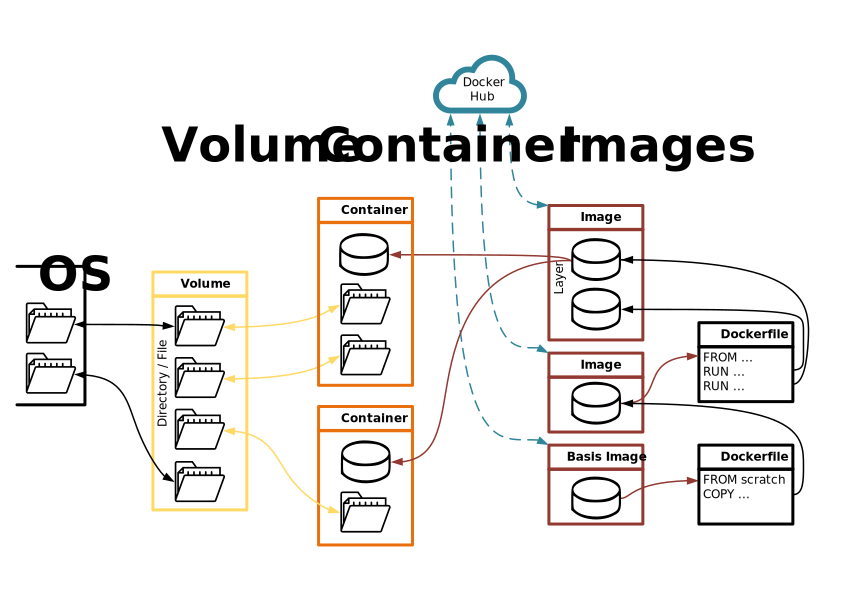

# Docker

Docker is a strong tool to quickly setup entire environments and it has a great flexebility.

The topics I want to share are the following:
- Dockerfile
- Interation between Container/Volume/Images

# Dockerfile

A dockerfile does contain the information how a image is constructed.

# Interation between Container/Volume/Images

The following picture illustrates the interactions between the 'main components'.

> The icons come from *www.flaticon.com*

Lets discuss the image from left to right. The start of everything is the **Dockerfile**. Images are created out of a dockerfile and every command in the dockerfile does create a **Layer** of an image.

**Images** do consist out of multiple Layers. Every layer does 